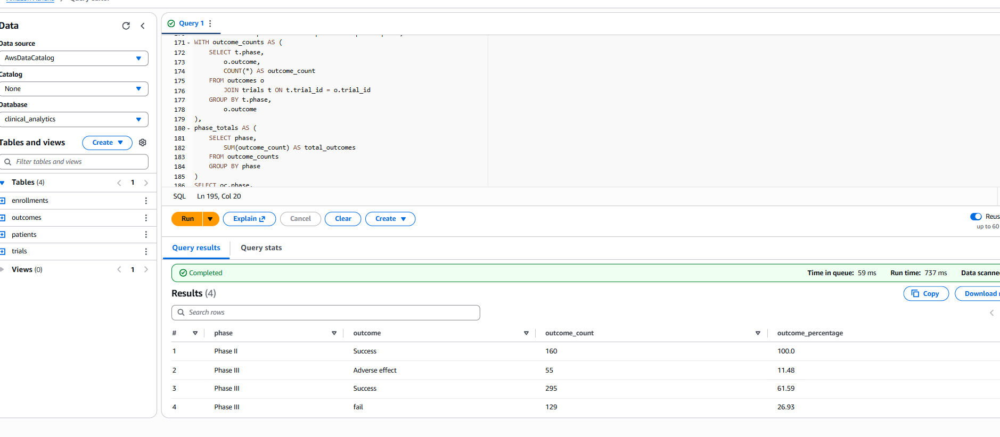
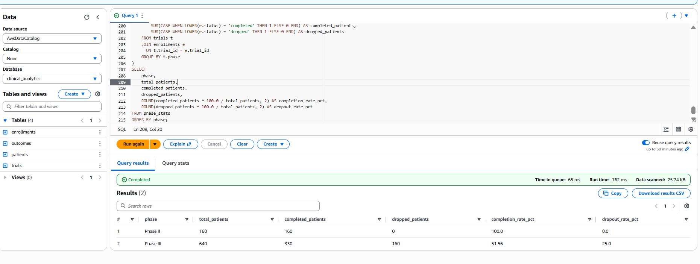

# Clinical Trial Analytics (AWS Athena + SQL + Power BI)

## Project Overview
This project demonstrates an end-to-end clinical trial analytics pipeline using AWS.
The objective is to analyze patient dropouts, completion rates, and outcome distributions
across different trial phases.

---

## Business Problem
Clinical trials are expensive and time-sensitive.
High dropout rates can increase cost, delay approvals, and reduce study quality.

This project helps answer:
- Which trial phase has higher dropouts?
- What is the overall completion rate?
- How are outcomes distributed?

---

## Data Architecture
- CSV data stored in Amazon S3 (data lake)
- External tables created in Amazon Athena
- SQL used to compute KPIs
- Power BI used for visualization







---

## Key KPIs (Athena SQL)
- Advanced phase-wise completion and dropout analysis using CTEs
  (see `kpi_phase_performance_cte.sql`)

### Dropout Rate by Phase
```sql
SELECT t.phase,
       COUNT(*) AS dropped_patients
FROM trials t
JOIN enrollments e
  ON t.trial_id = e.trial_id
WHERE LOWER(e.status) = 'dropped'
GROUP BY t.phase;

WITH phase_stats AS (
    SELECT
        t.phase,
        COUNT(*) AS total_patients,
        SUM(CASE WHEN LOWER(e.status) = 'completed' THEN 1 ELSE 0 END) AS completed_patients,
        SUM(CASE WHEN LOWER(e.status) = 'dropped' THEN 1 ELSE 0 END) AS dropped_patients
    FROM trials t
    JOIN enrollments e
      ON t.trial_id = e.trial_id
    GROUP BY t.phase
)
SELECT
    phase,
    total_patients,
    completed_patients,
    dropped_patients,
    ROUND(completed_patients * 100.0 / total_patients, 2) AS completion_rate_pct,
    ROUND(dropped_patients * 100.0 / total_patients, 2) AS dropout_rate_pct
FROM phase_stats
ORDER BY phase;
